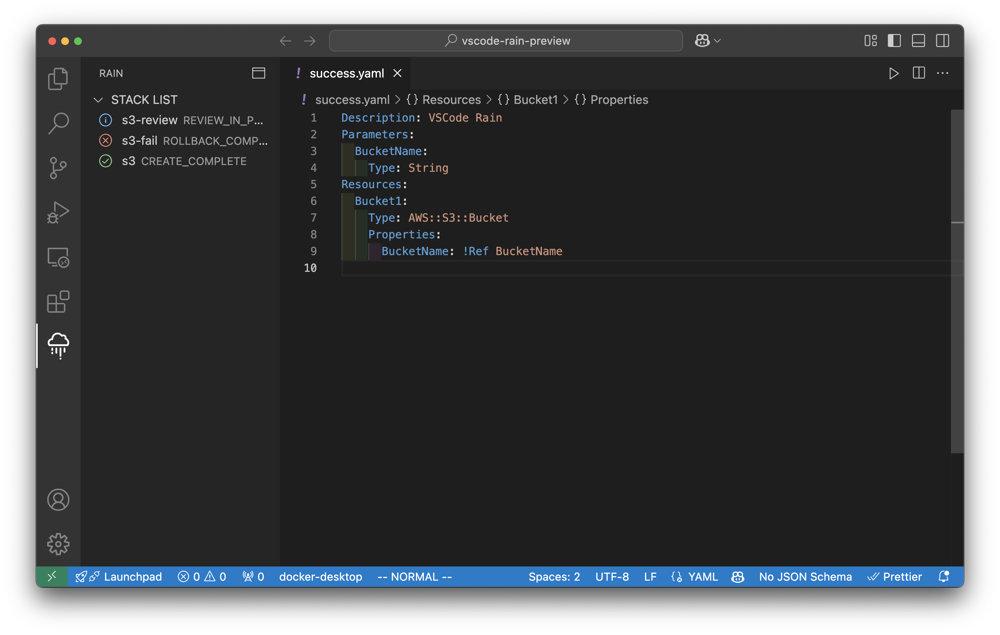

# vscode-rain

VS Code Rain uses [Rain](https://github.com/aws-cloudformation/rain) which is a command line tool for working with AWS CloudFormation templates and stacks.  

> [!NOTE]
> VS Code Rain is not an official AWS tool and currently tested only on macOS.

## Features

- `Rain: Build starter CloudFormation templates`
  - 
- `Rain: Deploy a new stack with active file`
  - 
- `Rain: Deploy an existing stack with active file`
- `Rain: Open console with browser`

## Requirements
Requires `rain` to be installed: `brew install rain`.

See the [Getting started](https://github.com/aws-cloudformation/rain?tab=readme-ov-file#getting-started) for more information.

If you do not use the default profile, set the required profile in rain.profile.

## Extension Settings

* `rain.path`: path to the `rain` command, optionally including [parameters](https://github.com/aws-cloudformation/cfn-python-lint/#parameters) as well.
* `rain.profile`: AWS profile name. Read from the AWS CLI configuration file.
